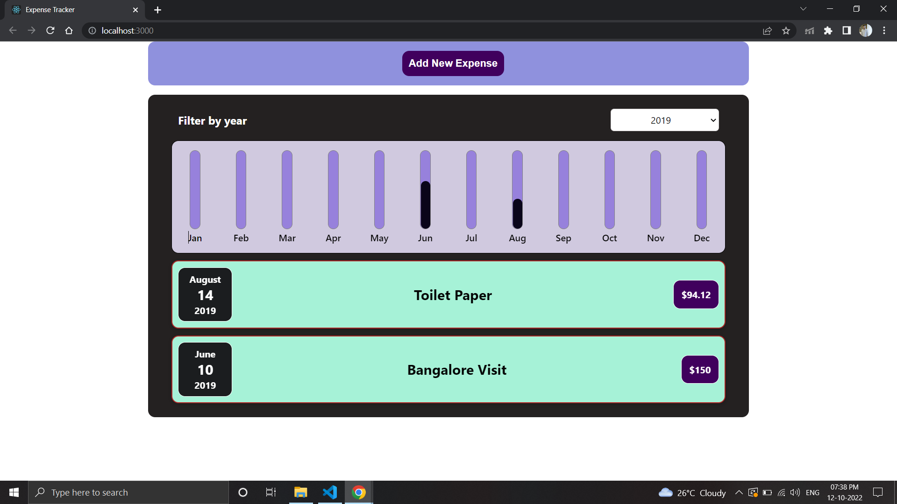

# Expense Tracker App Built with React

## Features

- Render expense items defined in source code
- Take User input expense items
- Filter expense items based on year
- Dynamically show expense via bar chart


## Deployment

CI/CD pipelines has been configured via GitHub actions will be deploye code to Azure App Service . Navigate to below link to view app

```bash
  https://reactexpensetracker.azurewebsites.net/
```

## Screenshots


