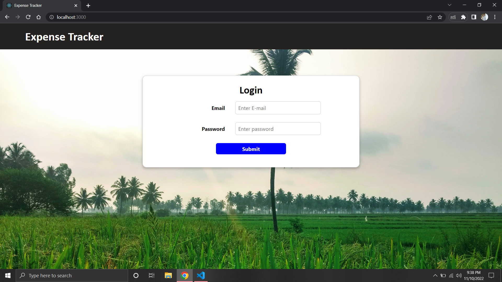
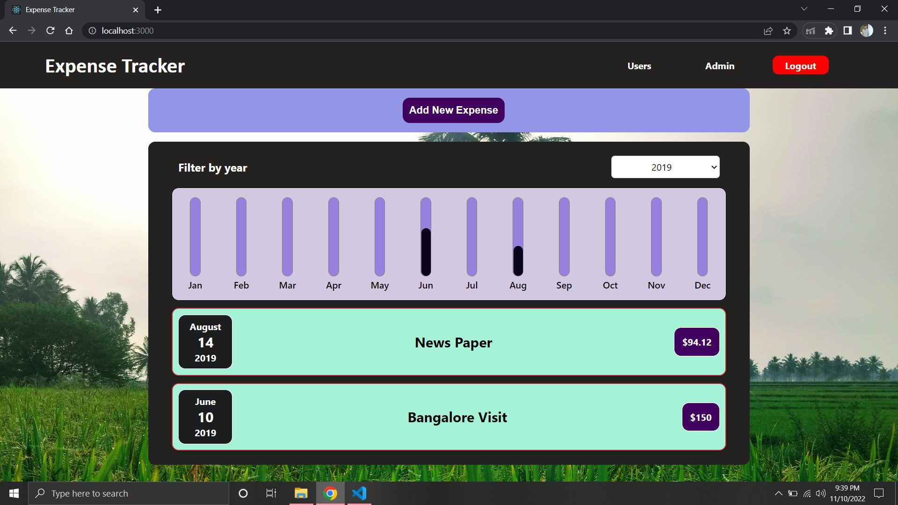

# Expense Tracker App 

## Built with

- HTML
- CSS
- JavaScript
- React

## Features

- Validate Admin Login
- Render expense items defined in source code
- Take User input expense items
- Perform validation on user input data and show error message via CSS Modal
- Filter expense items based on year
- Dynamically show expense via bar chart

## Installation

```bash
  git clone https://github.com/sriharin207/Expense-Tracker.git
```
```bash
  npm install
```
```bash
  npm start / npm run build
```

## Deployment

CI/CD pipelines has been configured via GitHub actions which will be deploye react app to Azure App Service . Navigate to below link to view live app

```bash
  https://reactexpensetracker.azurewebsites.net/
```

## Login Credentials

To login to the site ,use below credentials

`Email-ID : admin@gmail.com`

`Password : admin1234`

## Screenshots



